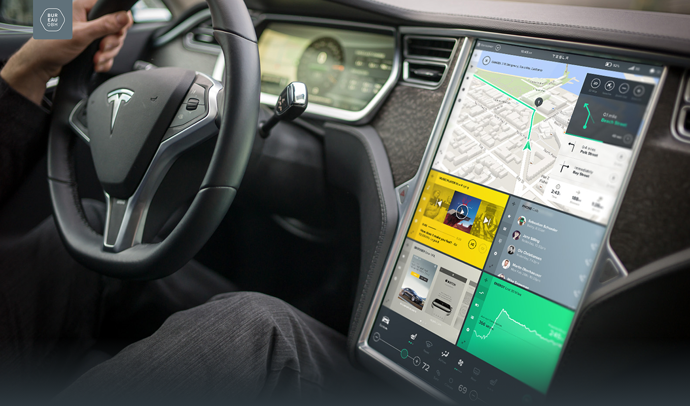
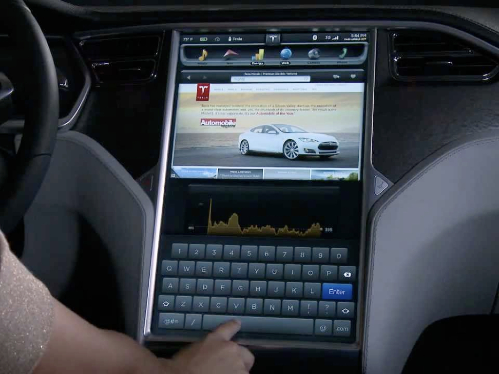
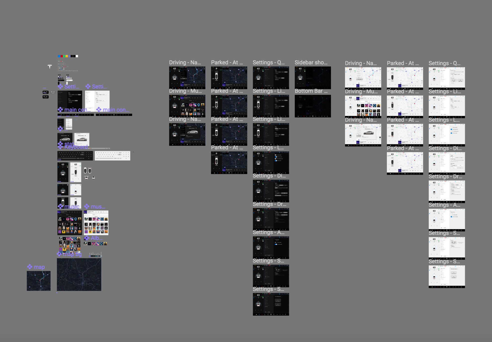

## Ziel der Challenge

Ganztägige Challenge als praktischer Prüfungsteil. Bei der Challenge werden wir Ihnen eine Aufgabe stellen, die Sie in einem 5-er Team lösen müssen. Ziel dieser Challenge ist es die erlernten Inhalte von WBA1 eigenverantwortlich in einer **freien** und **kreativen** Art und Weise anzuwenden. Zur Abgrenzung zu einer normalen Hochschulprüfung soll die Challenge den Raum anbieten, neben den erworbenen fachlichen Skills, die soft-skills selber auszutesten, wie z.B.: Arbeit in der Gruppe, Nutzung des Webs für das Lösen von Fragestellungen, finden von kreativen Lösungsansätzen zu einem Problem usw.

### An wen richtet sich die Challenge?

An alle, die in diesem Semester das Modul "Web-basierte Anwendungen 1: WWW-Technologien" absolvieren möchten.

### Die Aufgabe

Richtig - es geht um den Tesla. Genauer genommen das Model "Tesla Model S 85". Wie ihr sicherlich wisst, hat dieses tolle Auto eine Reihe an innovativen Dingen eingebaut. Unter anderem einen großen Screen. Es handelt sich genauer genommen um einen 17-Zoll (43 cm) Touchscreen. Und das ist unsere Ausgangslage für die Challenge!

Der Screen ist in verschiedene Bereiche unterteilt und Dient dem Fahrer dazu eine Übersicht über das Auto zu behalten. Weiterhin dient der Bildschirm auch als Car-Infotainment-System mit dem der Fahrer seine Musik steuern kann. Weiterhin werden verschiedene andere Funktionalitäten angeboten, wie z.B.: eine Übersicht über den Ladezustand des Fahrzeugs, eine integrierte Kalenderübersicht mit Terminen, usw.

Die Aufgabe besteht darin, dass Ihr Euch eine Funktionalität überlegt.

Anbei ein paar Moods was so alles dargestellt werden kann:

<a id="previous" href="#">previous</a>
<a id="next" href="#" onclick="next();return false;">next</a>

### Welche Funktionalitäten könnte der Screen beinhalten?

Folgende Funktionen kann der Screen beinhalten. Wir haben Euch direkt auch Hinweise zur Anbindung bestimmter APIs gegeben. Ihr müsst nicht zwingend diese APIs verwenden und auch nicht genau die Funktionalitäten abbilden. Seid kreativ und baut was anderes, sinnvolles oder auch was lustiges. Hauptsache ihr tobt Euch mit dem gelernten HTML, CSS und Javascript-Wissen aus.

#### Mögliche Funktionen

* Medien (Audioplayer)
  * API: [Soundcloud](https://developers.soundcloud.com/docs/api/guide)
  * API: [iTunes (nur mit PreviewSongs)](https://affiliate.itunes.apple.com/resources/documentation/itunes-store-web-service-search-api/#lookup)
  * API: https://www.last.fm/api
* Navigation & Karte
  * API: [OpenStreetMap](http://wiki.openstreetmap.org/wiki/API_v0.6)
  * API: [GoogleMaps](https://developers.google.com/maps/documentation/javascript/?hl=de)
* Kontaktmangement
  * API: [Google People API](https://developers.google.com/people/quickstart/js)
  * Telefon API: [Viber](https://developers.viber.com/docs/api/rest-bot-api/)
* Kalender
  * API: [Outlook Kalendar](https://msdn.microsoft.com/en-us/office/office365/api/calendar-rest-operations)
  * API: [Google Calendar](https://developers.google.com/google-apps/calendar/quickstart/js)
  * API: [Outlook](https://msdn.microsoft.com/en-us/office/office365/api/calendar-rest-operations)
* Energieanzeige (Reichweitenkalkulation, Echtzeit-Graph zum Energieverbrauch, Graph zur Rekurpation, ...)
  * [Framework: d3](https://d3js.org/)
* [Steuerungsfunktionen (Klimaanlage, Innenraumsteuerungen, Abstandssensoren)]
  * Wetter API: https://openweathermap.org/api
  * Abstandssensoren: [d3 Framework](https://d3js.org/)

### Die Challenge eine Prüfung - where is the difference

Die Challenge wird als praktischer Prüfungsteil gewertet. Jedoch haben die Studierenden viele Freiheiten und nur wenige Rahmenbedingungen die erfüllt werden müssen.

Wir haben auch noch ein spannendes Board gefunden mit vielen Assets die so ein Screen beinhalten kann. Dort findet Ihr Icons & ganze Screens. Ihr könnt diese auch als .png, .svg exportieren und nutzen: [https://www.figma.com/file/OIVSH9zbbnAAyRvoFE0dmowA/Tesla-Model-3](https://www.figma.com/file/OIVSH9zbbnAAyRvoFE0dmowA/Tesla-Model-3)

Übrigens auch ein spannender Blogpost dazu: [https://blog.figma.com/what-teslas-model-3-ui-reveals-about-its-vision-for-the-future-eb01a75ae979](https://blog.figma.com/what-teslas-model-3-ui-reveals-about-its-vision-for-the-future-eb01a75ae979)

Wer noch weitere Inspirationen sucht, kann auch auf der [offiziellen Tesla Seite](https://www.tesla.com/support/detailed-touchscreen-walkthrough) diverse Tutorials zum Touchscreen ansehen.

#### Die Rahmenbedingungen

* Fresh Code
* Commit very often - jeder studierende sollte min. 2 Commits erzeugen. Wir können und werden das nachvollziehen.
* Copy & Paste ist nicht erlaubt [Is copy & paste programming bad?](https://softwareengineering.stackexchange.com/questions/87696/is-copy-paste-programming-bad#87699)

#### Die Do's und die Freiheiten

* Die Suche im Web nach Lösungen
* Austausch mit anderen Teams auf der Suche nach Lösungen
* Es gibt nicht "die eine" finale und beste Lösung
* Der Zugriff auf Mentoren und Experten
* Sich aktiv mit Problemstellungen auseinander zu setzen und nach Lösungen zu suchen
* Spass am Gerät haben ;)

#### Darf ich schon vorher zu hause an dieser Aufgabe arbeiten und programmieren?

JA! Jedoch ist es sehr wichtig, dass ihr am Tag der Challenge dokumentiert was ihr mitgebracht habt und was ihr in der Challenge realisieren wollt. Nutzt aber auch die Vorbereitung um Euch Skizzen, Mockups, Ideen zu generieren damit ihr am Tag der Challenge nicht Zeit damit verliert um nachzudenken was ihr eigentlich machen wollt. 

### Ablauf

* **Donnerstag, 30. November 2017**: Challenge Announcement und Teambuilding
* **Zwischen dem 30. November - 07. Dezember 2017**:
	* Teams machen sich Gedanken über einen Lösungsweg, gerne eigene Prototypen zum üben programmieren, Skizzen, Skribbles, etc.
	* Announcement von 12 API's und Frameworks (HTML/CSS/Javascript, 6 pro Themenblock), mit dem ziel pro Themenblock 2 API's einzusetzen
	* Bekanntgabe der Bewertungskriterien
	* Bekanntgabe der Vorgaben für das Pitch-Deck
* **Donnerstag, 07. Dezember 2017**: Challenge-Tag
	* **09:00 Uhr**: Warm Welcome!
	* **09:15 Uhr**: Team Pitches
	* **09:30 Uhr**: hack, hack, hack
	* **18:00 Uhr**: Pichting-Time

### Vorgaben für die Pitch-Präsentation

Wird in der Woche zwischen dem 30. November - 07. Dezember 2017 bekannt gegeben.

### Bewertungskriterien

Werden in der Woche zwischen dem 30. November - 07. Dezember 2017 bekannt gegeben.

### Material
- [What are the pre requisites to participating in a Hackathon?](https://www.quora.com/What-are-the-pre-requisites-to-participating-in-a-Hackathon?share=1)
- Falls die Anmeldung via PSSO nicht möglich ist, verwenden Sie bitte folgenden [Prüfungsanmeldung Vordruck](../../download/pruefungsanmeldung.docx), komplettieren und unterschreiben ihn. Senden Sie diesen dann bis zum 24.11.2017 als PDF an studium-gm@th-koeln.de.
